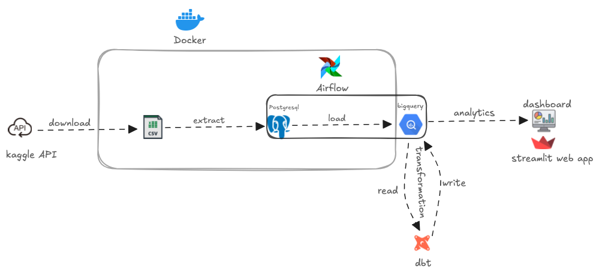
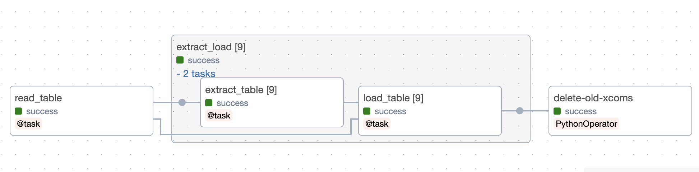
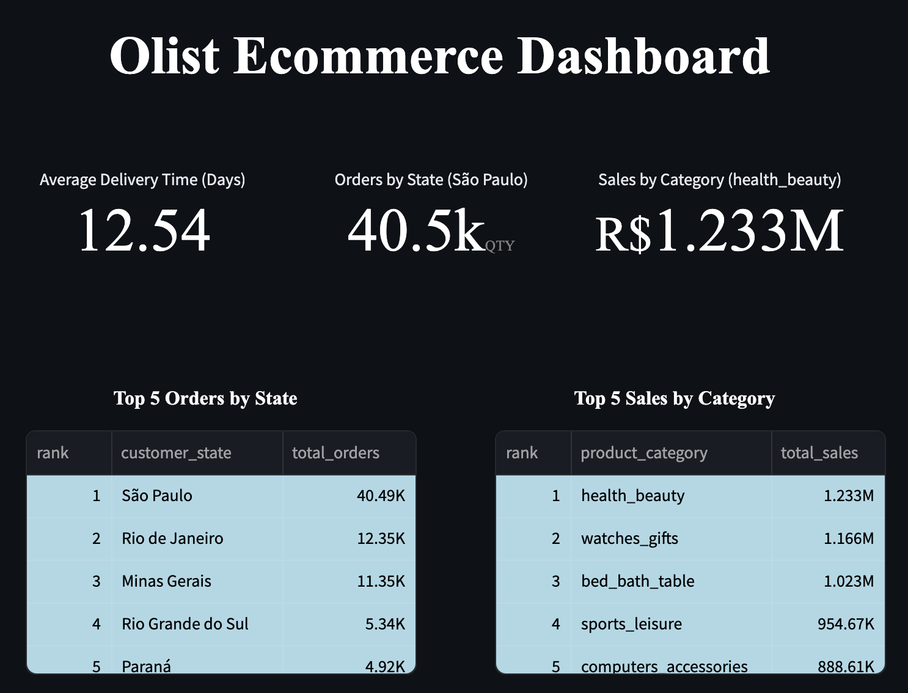

# OlistELT Pipeline
<div align="center">
   
   
   
   
   
   
   
   
</div>



## Demo


## Screenshots






## Environment Variables

To run this project, you will need two API keys and two .env files (postgresql and airflow)


`KAGGLE API KEY`

`GCP SERVICE ACCOUNT KEY`

| Postgres env | Airflow env| 
| -------- | -------- | 
|  `POSTGRES_USER`   |  `_AIRFLOW_WWW_USER_USERNAME`    | 
| `POSTGRES_PASSWORD`    | `_AIRFLOW_WWW_USER_PASSWORD`  | 
|  `POSTGRES_DB` ||

```bash
postgre_docker_init/
├── ingestion/
│   └── kaggle.json
|   └── .env
├── airflow/
|   └── .env
│   └── config/
|        └── service-account.json
├── dbt/
|    └── service-account.json
|
└── dashboard/
    └── .streamlit/
        └── secrets.toml

```
## Run Locally

Clone the project

```bash
  git clone https://github.com/lawal-hash/OlistELT.git
```

Go to the project directory

```bash
  cd OlistELT
```

Install dependencies

```bash
  pip install -r requirements.txt
```

Start the project in the following order

| Folder | Command one| Command two|
| -------- | -------- | --------|
|  ingestion |  `cd ingestion`    | `docker compose up` |
| airflow    | `cd airflow`  | `docker compose up`|

Add the following connection ids from with Airflow UI. Go to Admin -> Connection then add the following

`Postgres`
* Connection Id = `postgres_conn_id`
* Connection Type = `Postgres`
* Host = `xxx`
* Schema = `xxx`
* Login = `xxx`
* Password = `xxx`
*  Port = `xxx`

`Google Cloud Platform`

* Connection Id = `gcp_conn_id`
* Connection Type = `Google Cloud`
* Project ID = `xxx`
* Keyfile Path = `/opt/airflow/config/service-account.json`

values `xxx` are the same as the one in Postgres .env file.


Change the Dag state from *paused* to *active*. Ensure the Dag status is sucessful before proceeding to the next step.
| Folder | Command one| Command two|  
| -------- | -------- | --------|
|  dbt |`cd dbt/olist_dbt` | `chmod +x run.sh && ./run.sh` | 

Start the dashboard server using the command below

| Folder | Command one| Command two|
--------|--------|--------|
|dashboard |`cd dashboard` | `streamlit run app.py`|

## Authors

- [@lawal-hash](https://github.com/lawal-hash)

